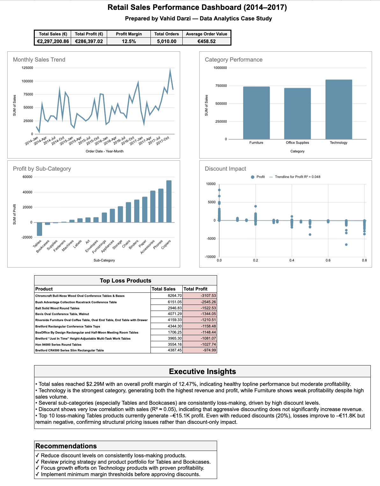

# Retail Sales Performance Dashboard (2014–2017)

## 📊 Dashboard Preview

## 📊 Project Overview

This project analyzes retail sales data from 2014 to 2017 using Google Sheets, focusing on sales performance, profitability, discount impact, and product-level insights.

The goal of this case study is to demonstrate practical data analytics skills including:

- Data cleaning
- Pivot table analysis
- KPI design
- Dashboard building
- Business insight generation

All analysis and visualization were performed directly in Google Sheets.

---

## 🔗 Live Dashboard

You can view the interactive dashboard here:

👉 https://docs.google.com/spreadsheets/d/1lKZmkNOVzs2LMeCt6Ddg_NQsAgroSDlZy4jRpTGYwR0/edit?usp=sharing

---

## 📈 Key KPIs

- Total Sales: $2.29M  
- Total Profit: $286K  
- Profit Margin: 12.47%  
- Total Orders: 5,010  
- Total Customers: 794  
- Average Order Value: $458  

---

## 🔍 Key Insights

- Technology is the strongest category, generating both the highest revenue and profit.
- Furniture shows weak profitability despite high sales volume.
- Tables and Bookcases are consistently loss-making sub-categories driven by heavy discounting.
- Discount has very low correlation with sales (R² ≈ 0.05), meaning aggressive discounts do not significantly increase revenue.
- Top loss-making products generate high sales but negative profit, indicating structural pricing issues.

Even after simulating reduced discounts (20%), Tables remain unprofitable, confirming pricing and cost problems rather than discount-only effects.

---

## ✅ Recommendations

- Reduce discount levels on loss-making products.
- Review pricing strategy for Tables and Bookcases.
- Focus growth efforts on Technology products with proven profitability.
- Implement minimum margin thresholds before approving discounts.

---

## 🛠 Tools Used

- Google Sheets
- Pivot Tables
- Dashboard Design
- Basic Statistical Analysis

---

## 👤 Author

**Vahid Darzi**  
Junior Data Analyst  

LinkedIn: https://www.linkedin.com/in/vahid-darzi

---

## 📁 Dataset

Sample retail dataset commonly used for analytics practice (Superstore-style transactional data).

---

## 📌 Notes

This project was created as part of a career transition into Data Analytics and serves as a portfolio case study.
